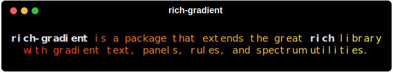
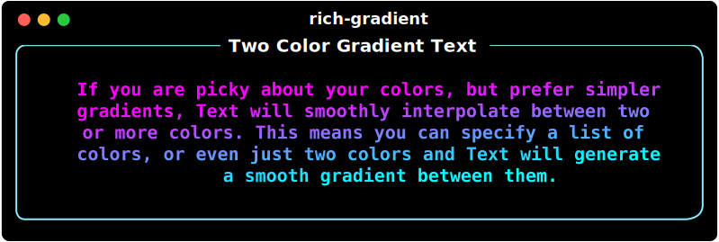

<a href="https://maxludden.github.io/rich-gradient/" alt="rich-gradient">
  <h1>
    
  </h1>
</a>

<p align="center">
  <a href="https://www.python.org/"></a>
  <a href="https://pypi.org/project/rich_gradient/"></a>
  <a href="https://github.com/astral-sh/uv"></a>
</p>



## Purpose

`rich-gradient` layers smooth foreground and background gradients on top of [Rich](https://github.com/Textualize/rich) renderables.
It includes a drop-in `Text` subclass, wrappers for `Panel` and `Rule`, utilities for building palettes, and
a rich-click (Click) CLI for trying gradients from the terminal.

## Highlights

- Works anywhere Rich expects a `ConsoleRenderable`, including panels, tables, and live updates.
- Generates color stops automatically or from CSS color names, hex codes, RGB tuples, or `rich.color.Color` objects.
- Supports foreground and background gradients, rainbow palettes, and deterministic color spectrums.
- Ships with ready-to-use renderables:
  - [`Text`](text.md)
  - [`Gradient`](gradient.md)
  - [`Panel`](panel.md)
- [`Rule`](rule.md)
- [`Spectrum`](spectrum.md)
- And their animated counterparts.
- Includes a CLI for quick experiments and SVG export for documentation or asset generation.
- Auto-bootstraps a configuration file (`~/.rich-gradient`) where you can toggle
  animation globally and customise the default spectrum palette.

## Installation

`rich-gradient` targets Python 3.10+.

### [uv](https://github.com/astral-sh/uv)

```shell
# Recommended: use uv
uv add rich-gradient

# or via `uv pip`
uv pip install rich-gradient
```

### [Pip](https://pip.pypa.io/en/stable/)

Or with pip:

```shell
# via pip
pip install rich-gradient
```

<a href="https://maxludden.github.io/rich-gradient/" alt="Read the Docs" class="btn">
  <span>📘 Read the Docs</span>
</a>

## CLI Usage

The CLI is built with Click + rich-click. Subcommands:

- `print`: gradient text. Options: `--colors/-c`, `--bgcolors`, `--rainbow`, `--hues`, `--style`, `--justify`, `--overflow`, `--no-wrap`, `--end`.
- `rule`: gradient rule. Options: `--title`, `--title-style`, `--colors`, `--bgcolors`, `--rainbow`, `--hues`, `--thickness`, `--align`, `--end`.
- `panel`: gradient panel. Options: `--colors`, `--bgcolors`, `--rainbow`, `--hues`, `--title`, `--title-style`, `--title-align`, `--subtitle`, `--subtitle-style`, `--subtitle-align`, `--style`, `--border-style`, `--padding`, `--vertical-justify`, `--text-justify`, `--justify`, `--expand/--no-expand`, `--width`, `--height`, `--box`, `--end`, `--animate`, `--duration`.
- `markdown`: gradient markdown. Options: `--colors`, `--bgcolors`, `--rainbow`, `--hues`, `--style`, `--justify`, `--vertical-justify`, `--overflow`, `--no-wrap`, `--end`, `--animate`, `--duration`.

Quick examples:

- Gradient text: `rich-gradient print "Hello [b]world[/b]!" -c magenta,cyan`
- Rainbow text: `rich-gradient print "Rainbow!" --rainbow`
- Panel with title: `rich-gradient panel "Panel content" -c red,blue --title "Gradient Panel"`
- Rule with title: `rich-gradient rule --title "Section" -c "#f00,#0ff"`
- Gradient markdown: `rich-gradient markdown "# Title" --colors "#ff0,#0ff" --justify center`

### Contributor notes

- Tests: `pytest` works without an editable install because `tests/conftest.py` adds `src/` to `sys.path`. No extra env tweaks needed; just install deps and run `pytest`.

## Usage

### Basic Gradient Text Example

To print a simple gradient just substitute the `Gradient` class for the `Text` class in the rich-gradient library.

```python
from rich.console import Console
from rich_gradient import Gradient

console = Console()
console.print(Gradient("Hello, World!"))
```


---

## Gradient Text with Specific Colors

If you want a bit more control of the gradient, you can specify the colors you want to use in the gradient by passing them as a list of colors to the `colors` parameter.

### Color Formats

Color can be parsed from a variety of formats including:


### Example Code

#### Specific Two-Color Gradient Example

```python
console.print(
    Text(
        "This a gradient with two colors.",
        colors=["red", "orange"]
    ),
    justify="center"
)
```



---

#### Specific Four-Color Gradient Example

```python
console.print(
    Text(
        "This a gradient uses four specific colors.",
        colors=["red", "#ff9900", "#ff0", "Lime"],
        justify="center"
    )
)
```

#### Specific Color Gradient Result


---

### Rainbow Gradient Example

If four colors isn't enough, you can use the 'rainbow' parameter to generate a rainbow gradient that spans the entire spectrum of colors randomly.

```python
console.print(
    Text(
        "This is a rainbow gradient.",
        rainbow=True,
        justify="center"
    )
)
```


<p style="text-align:right;">*The rainbow gradient is generated randomly each time the code is run.</p>

---

### Still inherits from `rich.text.Text`

Since `Gradient` is a subclass of `Text`, you can still use all the same methods and properties as you would with `Text`.

```python
console.print(
    Gradient(
        "This is an underlined rainbow gradient.",
        rainbow=True,
        style="underline"
    ),
    justify="center"
)
console.line()
console.print(
    Gradient(
        "This is a bold italic gradient.",
        style="bold italic"
    ),
    justify="center"
)
console.line()
```


