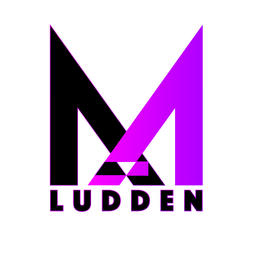

# [](https://maxludden.github.io/rich-gradient/)

<!-- markdownlint-disable MD033 MD013 -->
<p align="center">
  <a href="https://www.python.org/"></a>
  <a href="https://pypi.org/project/rich_gradient/"></a>
  <a href="https://pepy.tech/project/rich-gradient"></a>
  <a href="https://github.com/astral-sh/uv"></a>
</p>


## Purpose

`rich-gradient` layers smooth foreground and background gradients on top of
[Rich](https://github.com/Textualize/rich) renderables.
It includes a drop-in `Text` subclass, wrappers for `Panel` and `Rule`,
gradient-aware Markdown, convenience wrappers for common Rich renderables,
animated variants, and utilities for building palettes.

## Highlights

- Works anywhere Rich expects a `ConsoleRenderable`,
  including panels, tables, and live updates.
- Generates color stops automatically or from CSS color names,
  hex codes, RGB tuples, or `rich.color.Color` objects.
- Supports foreground and background gradients,
  rainbow palettes, and seedable color spectrums.
- Ships with ready-to-use renderables:
  - [`Text`](docs/text.md)
  - [`Gradient`](docs/gradient.md)
  - [`Panel`](docs/panel.md)
  - [`Rule`](docs/rule.md)
  - [`Spectrum`](docs/spectrum.md)
  - [`Markdown`](docs/gradient.md)
  - [`Table`, `Tree`, `Columns`, `Pretty`, and `Syntax`](docs/renderables.md)
  - And their animated counterparts.
- `AnimatedText`, `AnimatedGradient`, `AnimatedPanel`, `AnimatedRule`, and
  `AnimatedMarkdown` for live gradient updates.
- Loads optional JSON configuration from `~/.rich-gradient/config.json`, where
  you can toggle animation globally and customize the default spectrum palette.

### What's new in v0.3.12

- **Added** an internal cached gradient ramp for `Gradient` rendering. Foreground
  and background styles are precomputed per render span and reused across
  segment lookups.
- **Added** benchmark coverage for static gradients, animated frame rendering,
  long text, and gradient panels.
- **Added** gradient convenience constructors for Rich `Table`, `Tree`,
  `Columns`, `Pretty`, and `Syntax`, each with a runnable module demo.
- **Changed** gradient segment rendering is shared across `Gradient`, `Rule`,
  and `AnimatedRule` for more consistent cell-aware output.
- **Changed** CLI functionality moved to
  [`rich-gradient-cli`](https://github.com/maxludden/rich-gradient-cli); this
  package is the core renderable library.
- **Added** RGB tuple color stops and stricter tuple channel validation.
- **Fixed** duration-limited `AnimatedGradient` instances now clean up their
  running state so they can be restarted.
- **Fixed** `AnimatedPanel` now accepts two-item regex highlight tuples like
  `("pattern", "style")`, matching the base highlight parser.
- **Fixed** `Rule` and `AnimatedRule` empty-renderable fallbacks and thickness
  handling.
- **Fixed** `AnimatedGradient` refresh-rate validation and restart-after-stop
  behavior.

- See the [CHANGELOG](docs/CHANGELOG.md) for more details.

## Installation

`rich-gradient` targets Python 3.10+.

### [uv](https://github.com/astral-sh/uv)

```shell
# Recommended: use uv
uv add rich-gradient

# or via `uv pip`
uv pip install rich-gradient
```

### [Pip](https://pip.pypa.io/en/stable/)

Or with pip:

```shell
# via pip
pip install rich-gradient
```

[📘 Read the Docs](https://maxludden.github.io/rich-gradient/)

### Contributor notes

- Tests: `pytest` works without an editable install because
  `tests/conftest.py` adds `src/` to `sys.path`. No extra
  env tweaks needed; just install deps and run `pytest`.

## Usage

### Basic Gradient Text Example

Use `Text` when you want a drop-in `rich.text.Text` replacement with gradient
spans applied to the text itself.

```python
from rich.console import Console
from rich_gradient import Text

console = Console()
console.print(Text("Hello, World!"))
```


---

## Gradient Text with Specific Colors

If you want a bit more control of the gradient,
you can specify the colors you want to use in the gradient
by passing them as a list of colors to the `colors` parameter.

### Color Formats

Color can be parsed from a variety of formats including:


### Example Code

#### Specific Two-Color Gradient Example

```python
console.print(
    Text(
        "This a gradient with two colors.",
        colors=["red", "orange"],
    ),
    justify="center"
)
```


---

#### Specific Four-Color Gradient Example

```python
console.print(
    Text(
        "This a gradient uses four specific colors.",
        colors=["red", "#ff9900", "#ff0", "Lime"],
        justify="center",
    ),
)
```

#### Specific Color Gradient Result


---

### Rainbow Gradient Example

If four colors aren't enough, you can use the 'rainbow' parameter to generate
a rainbow gradient that spans the full spectrum palette.

```python
console.print(
    Text(
        "This is a rainbow gradient.",
        rainbow=True,
        justify="center",
    ),
)
```


Use `Spectrum(hues=..., seed=...)` when you need reproducible color stops.

---

### Still inherits from `rich.text.Text`

Since `Text` is a subclass of `rich.text.Text`, you can still use all
the same methods and properties as you would with `Text`.

```python
console.print(
    Text(
        "This is an underlined rainbow gradient.",
        rainbow=True,
        style="underline",
    ),
    justify="center"
)
console.line()
console.print(
    Text(
        "This is a bold italic gradient.",
        style="bold italic",
    ),
    justify="center"
)
console.line()
```


## Wrap Any Rich Renderable

Use `Gradient` when you want to paint across an existing Rich renderable, such
as Markdown, a table, a layout, or a standard Rich panel.

```python
from rich.console import Console
from rich.markdown import Markdown
from rich_gradient import Gradient

console = Console()
console.print(
    Gradient(
        Markdown("## Renderables\n\n- Text\n- Panels\n- Markdown"),
        colors=["#38bdf8", "#a855f7", "#f97316"],
        bg_colors=["#0f172a", "#1f2937"],
        justify="center",
    )
)
```

## Background Gradients

Pass `bg_colors` to `Text`, `Gradient`, `Panel`, `Rule`, or `Markdown` to apply
background color stops. A single background color is treated as a solid fill;
multiple stops interpolate across the rendered output.

```python
from rich_gradient import Text

Text(
    "Foreground and background gradient",
    colors=["#f8fafc", "#a7f3d0"],
    bg_colors=["#0f172a", "#1e293b"],
)
```

## Markdown

Use `Markdown` for a Rich Markdown renderable with the same gradient controls
as `Gradient`.

```python
from rich.console import Console
from rich_gradient import Markdown

console = Console()
console.print(
    Markdown(
        "# Gradient Markdown\n\nSupports **Rich Markdown** content.",
        colors=["cyan", "magenta", "gold1"],
    )
)
```

## CLI

This package no longer ships a command-line interface. Install
[`rich-gradient-cli`](https://github.com/maxludden/rich-gradient-cli) for
terminal commands that build on the renderables provided here.

<div align="center">
  <a href="https://github.com/maxludden/maxludden" style="text-decoration:none; color:inherit;">
      <p>Designed by Max Ludden</p>
  </a>
  <br />
  <a href="https://github.com/maxludden/maxludden" style="text-decoration:none; color:inherit;">
    
  </a>
</div>
