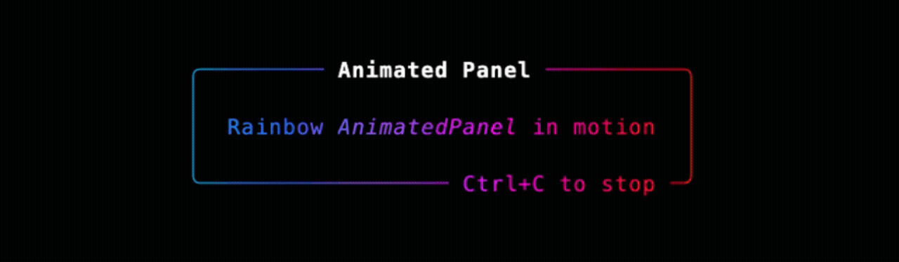

# Animation

`rich-gradient` provides animated variants of its core renderables for live terminal demos. They build on [`rich.live.Live`](https://rich.readthedocs.io/en/stable/live.html) to refresh the console at a steady frame rate while shifting the gradient phase.

## `AnimatedGradient`


```python
from rich.console import Console
from rich.markdown import Markdown
from rich_gradient.animated_gradient import AnimatedGradient

console = Console()
markdown = Markdown(
    "[b]Animated gradients[/b]\n\n"
    "- Run as a context manager\n"
    "- Or control start/stop manually\n"
    "- Adjust `phase_per_second` for speed"
)

with AnimatedGradient(
    markdown,
    rainbow=True,
    console=console,
    phase_per_second=0.2,
) as gradient:
    console.input("[dim]Press Enter to stop...[/dim]")
```

Key parameters:

- `refresh_per_second`: desired frame rate for the `Live` render loop.
- `phase_per_second`: how quickly the gradient cycles through its color stops.
- `repeat_scale`: stretch the palette across a wider span before repeating.
- `highlight_words` / `highlight_regex`: identical to the static `Gradient`.
- `start()`, `stop()`, `run()`: manual control when you want to integrate with custom event loops.

## `AnimatedPanel`



`AnimatedPanel` wraps the static [`Panel`](panel.md) helper, so it inherits title and subtitle highlighting alongside the animation controls above.

```python
from rich.panel import Panel as RichPanel
from rich_gradient.animated_panel import AnimatedPanel

panel = RichPanel(
    "Rainbow [i]AnimatedPanel[/i] in motion",
    title="Animated Panel",
    padding=(1, 2),
)

animated = AnimatedPanel(
    panel,
    rainbow=True,
    refresh_per_second=40,
    phase_per_second=0.15,
)
try:
    animated.run()
finally:
    animated.stop()
```

Both animated classes forward `console`, `expand`, `justify`, and color configuration to their static counterparts, making it easy to switch between live demos and static output.
