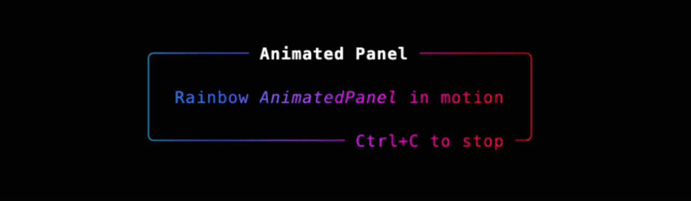

# Animation

`rich-gradient` provides animated variants of its core renderables for live terminal demos. They build on [`rich.live.Live`](https://rich.readthedocs.io/en/stable/live.html) to refresh the console at a steady frame rate while shifting the gradient phase.

## `AnimatedGradient`


```python
from rich.console import Console
from rich.markdown import Markdown
from rich_gradient.animated_gradient import AnimatedGradient

console = Console()
markdown = Markdown(
    "**Animated gradients**\n\n"
    "- Run as a context manager\n"
    "- Or control start/stop manually\n"
)

with AnimatedGradient(
    markdown,
    rainbow=True,
    console=console,
) as gradient:
    console.input("[dim]Press Enter to stop...[/dim]")
```

Key parameters:

- `refresh_per_second`: desired frame rate for the `Live` render loop.
- `repeat_scale`: stretch the palette across a wider span before repeating.
- `highlight_words` / `highlight_regex`: identical to the static `Gradient`.
- `duration`: optional automatic stop time, in seconds.
- `start()`, `stop()`, `run()`: manual control when you want to integrate with custom event loops.
- Defaults honour the global configuration; see [Configuration](configuration.md) for details.

When `duration` is set, `AnimatedGradient` stops itself once the deadline is
reached and clears its internal running state. You can call `start()` again on
the same instance after a duration-limited run finishes.

## `AnimatedText`

`AnimatedText` gives you the same gradient animation on top of Rich `Text`, with a helper to
swap content while the animation is running.

```python
from time import sleep
from rich_gradient.animated_text import AnimatedText

animated = AnimatedText("Loading...", rainbow=True)

with animated:
    sleep(1)
    animated.update_text("Almost there...")
    sleep(1)
```

Runnable example:

```bash
uv run python examples/animated_text_demo.py
```

## `AnimatedPanel`



`AnimatedPanel` wraps the static [`Panel`](panel.md) helper, so it inherits title and subtitle highlighting alongside the animation controls above.

```python
from rich.panel import Panel as RichPanel
from rich_gradient.animated_panel import AnimatedPanel

panel = RichPanel(
    "Rainbow [i]AnimatedPanel[/i] in motion",
    title="Animated Panel",
    padding=(1, 2),
)

animated = AnimatedPanel(
    panel,
    rainbow=True,
    refresh_per_second=40,
)
try:
    animated.run()
finally:
    animated.stop()
```

Animated renderables forward `console`, `expand`, `justify`, and color configuration
to their static counterparts, making it easy to switch between live demos and static
output.

`AnimatedPanel` accepts the same regex highlight shapes as `Gradient`, including
two-item tuples like `("AnimatedPanel", "bold cyan")`. Flags are optional and
default to `0`.

## `AnimatedRule`

`AnimatedRule` animates the same full-width rule rendering as [`Rule`](rule.md), while
using `AnimatedGradient` for live updates.

```python
from time import sleep
from rich_gradient.animated_rule import AnimatedRule

rule = AnimatedRule(
    title="Deploying",
    colors=["#38bdf8", "#a855f7", "#f97316"],
    thickness=2,
    refresh_per_second=30,
)

with rule.for_duration(2):
    sleep(2)
```

Titles are highlighted after the gradient is applied, and the animated rule uses the
same cell-aware renderer as the static `Rule` for wide glyphs, combining characters,
foreground gradients, and background gradients.
