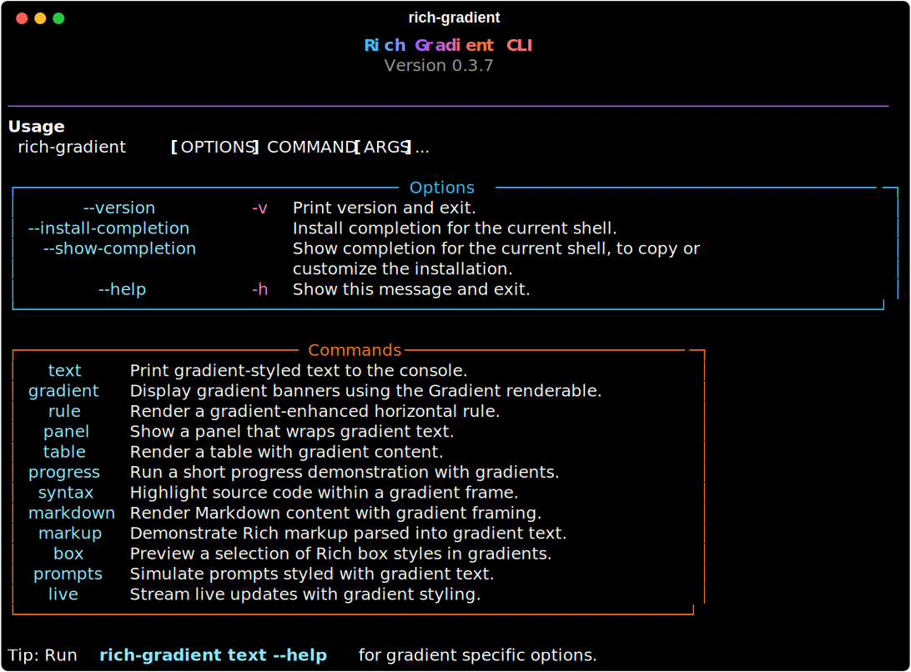

# CLI

`rich-gradient` ships with a Typer-based CLI that mirrors the capabilities of the library. It is ideal for quick experiments, demos during presentations, or exporting styled output to SVG.



Run `rich-gradient --help` (or `uv run rich-gradient --help`) to see the full command list.

## Core command: `text`

```
rich-gradient text "Hello, gradients!" -c "#38bdf8" -c "#a855f7" -c "#f97316"
```

Common options:

- `-c/--color`: repeatable foreground color stops.
- `-b/--bgcolor`: background color stops.
- `--rainbow`: generate a rainbow palette (ignored if colors are supplied).
- `--justify`, `--overflow`, `--no-wrap`: forwarded to `Text`.
- `--panel`, `--title`: wrap the output in a gradient-aware panel.
- `--hues`: control the number of auto-generated color stops when colors aren’t supplied.
- `--width`: render at a specific console width (useful before saving to SVG).
- `--record`: enable the Rich `Console` recorder; combine with `--save-svg`.
- `--save-svg PATH`: export the current render to an SVG, using the bundled gradient terminal theme.

## Additional demos

The CLI exposes shortcuts for many built-in renderables:

- `gradient`: display a banner using the high-level [`Gradient`](gradient.md) class.
- `panel`: render a gradient panel with gradient-accented title text.
- `rule`: preview the gradient rule thicknesses.
- `table`, `markdown`, `syntax`, `box`: show how gradients interact with common Rich components.
- `progress`, `live`, `prompts`: animated demonstrations that leverage [`AnimatedGradient`](animation.md) internally.

Each command accepts `--color`, `--bgcolor`, and `--rainbow` where it makes sense, so you can reuse palettes across different demos.
