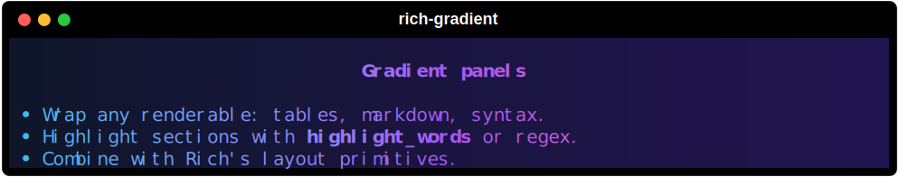
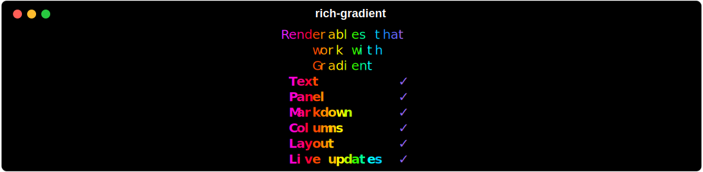

# Gradient

`rich_gradient.Gradient` wraps any Rich renderable—text, panels, tables, Markdown, even nested layouts—and paints a gradient across the composed output. It works with foreground and background colors, respects alignment, and can highlight words or regex matches along the way.

## Quick example

```python
from rich.console import Console
from rich.markdown import Markdown
from rich_gradient import Gradient

console = Console()
markdown = Markdown(
    """
## Gradient panels

- Wrap any renderable: tables, markdown, syntax.
- Highlight sections with `highlight_words` or regex.
- Combine with Rich's layout primitives.
""".strip()
)
console.print(
    Gradient(
        markdown,
        colors=["#38bdf8", "#a855f7", "#f97316"],
        bg_colors=["#0f172a", "#2c1067"],
        justify="center",
    )
)
```



The full example lives in `examples/gradient_showcase.py`.

## Working with different renderables

`Gradient` accepts a single renderable or an iterable. Each renderable is measured and interpolated to share the gradient stops, so you can layer panels, tables, and custom objects together.

```python
from rich.table import Table
from rich_gradient import Gradient

table = Table(title="Renderables that work with Gradient", show_header=False)
table.add_column("Renderable", style="bold")
table.add_column("Supported", justify="center")
for item in ("Text", "Panel", "Markdown", "Columns", "Layout", "Live updates"):
    table.add_row(item, "[bold green]✓[/]")

Gradient(table, rainbow=True, repeat_scale=1.8)
```



Key options:

- `colors` / `bg_colors`: list of color stops (same rules as [`Text`](text.md)).
- `rainbow` and `hues`: auto-generate palettes.
- `justify` / `vertical_justify`: align the renderable inside the gradient frame.
- `repeat_scale`: stretch or compress the gradient repeats.
- `highlight_words` / `highlight_regex`: apply extra styles after the gradient pass.

## Highlight configuration classes

For larger configurations, you can build highlight rules explicitly with the
dataclasses in `rich_gradient._highlight` and pass them into `Gradient`.

```python
import re

from rich.style import Style
from rich_gradient import Gradient
from rich_gradient._highlight import HighlightRegex, HighlightWords

rules_words = [
    HighlightWords(words=("error", "warning"), style=Style.parse("bold red")),
    HighlightWords(words=("hint",), style=Style.parse("italic cyan"), case_sensitive=False),
]

rules_regex = [
    HighlightRegex(pattern=re.compile(r"\b\d+\b"), style=Style.parse("bold yellow")),
]

Gradient(
    "error 42: warning: retry",
    colors=["#38bdf8", "#a855f7", "#f97316"],
    highlight_words=rules_words,
    highlight_regex=rules_regex,
)
```

You can still pass legacy mappings/tuples; `HighlightWords.from_config` and
`HighlightRegex.from_config` normalize both styles.

## Animation

Gradients can be animated by advancing the `.phase` attribute yourself or by using [`AnimatedGradient`](animation.md). Animated variants manage a `rich.live.Live` console and update the gradient smoothly without manual bookkeeping.
