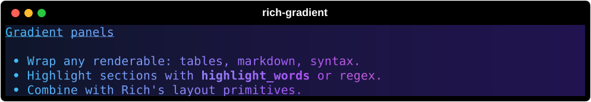

# Gradient

`rich_gradient.Gradient` wraps any Rich renderable—text, panels, tables,
Markdown, even nested layouts—and paints a gradient across the composed output.
It works with foreground and background colors, respects alignment, and can
highlight words or regex matches along the way. For Rich renderables you create
often, see the convenience wrappers in [Convenience Renderables](renderables.md).

## Quick example

```python
from rich.console import Console
from rich.markdown import Markdown
from rich_gradient import Gradient

console = Console()
markdown = Markdown(
    """
## Gradient panels

- Wrap any renderable: tables, markdown, syntax.
- Highlight sections with `highlight_words` or regex.
- Combine with Rich's layout primitives.
""".strip()
)
console.print(
    Gradient(
        markdown,
        colors=["#38bdf8", "#a855f7", "#f97316"],
        bg_colors=["#0f172a", "#2c1067"],
        justify="center",
    )
)
```



The full example lives in `examples/gradient_showcase.py`.

## Working with different renderables

`Gradient` accepts a single renderable or an iterable. Each renderable is measured and interpolated to share the gradient stops, so you can layer panels, tables, and custom objects together.

```python
from rich.console import Console
from rich_gradient import Table

table = Table(
    "Renderable",
    "Works",
    title="Renderables that work",
    rainbow=True,
)
for item in ("Text", "Gradient", "Panel", "Rule", "Markdown", "Table", "Tree", "Columns", "Pretty", "Syntax"):
    table.add_row(item, "✓")

Console().print(table)
```

{ width="240" style="display: block; margin: 1.5rem auto;" }

Key options:

- `colors` / `bg_colors`: list of color stops (same rules as [`Text`](text.md)).
- `rainbow` and `hues`: auto-generate palettes.
- `justify` / `vertical_justify`: align the renderable inside the gradient frame.
- `repeat_scale`: stretch or compress the gradient repeats. By default it is derived
  from the colors so one pass across the renderable runs from the first color to
  the last (`1.0` for two colors, `2.0` for three or more). Pass a number to override it.
- `highlight_words` / `highlight_regex`: apply extra styles after the gradient pass.

## Rendering performance

`Gradient` renders by converting Rich output into terminal-cell clusters and then
applying foreground and background styles to each cluster. To avoid rebuilding
the same interpolated `Style` objects for every character, the renderer keeps an
internal cached ramp for the active color stops, render span, repeat scale, and
gamma setting.

That cache is rebuilt automatically when foreground or background color stops
change, or when Rich renders at a different span. The public API does not expose
the ramp directly; use `colors`, `bg_colors`, `repeat_scale`, and `phase` as
normal. The optimization is most useful for long renderables and animated frames
where many clusters reuse the same terminal-cell positions.

Benchmark coverage lives in `tests/benchmark_perf.py` and includes static
gradient rendering, animated frame rendering, long text, and panel rendering.

## Highlight configuration classes

For larger configurations, you can build highlight rules explicitly with the
dataclasses in `rich_gradient._highlight` and pass them into `Gradient`.

```python
import re

from rich.style import Style
from rich_gradient import Gradient
from rich_gradient._highlight import HighlightRegex, HighlightWords

rules_words = [
    HighlightWords(words=("error", "warning"), style=Style.parse("bold #f00")),
    HighlightWords(words=("hint",), style=Style.parse("italic cyan"), case_sensitive=False),
]

rules_regex = [
    HighlightRegex(pattern=re.compile(r"\b\d+\b"), style=Style.parse("bold yellow")),
]

Gradient(
    "error 42: warning: retry",
    colors=["#38bdf8", "#a855f7", "#f97316"],
    highlight_words=rules_words,
    highlight_regex=rules_regex,
)
```

You can still pass legacy mappings/tuples; `HighlightWords.from_config` and
`HighlightRegex.from_config` normalize both styles.

## Animation

Gradients can be animated by advancing the `.phase` attribute yourself or by using [`AnimatedGradient`](animation.md). Animated variants manage a `rich.live.Live` console and update the gradient smoothly without manual bookkeeping.
