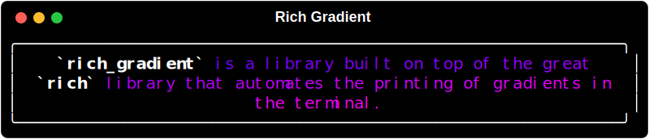
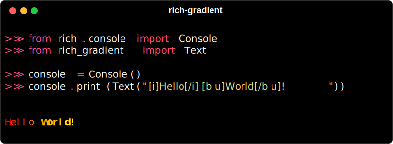

# 

<div class="badges">
    <a href="https://github.com/astral-sh/uv"></a>
    <a href="https://GitHub.com/maxludden/rich-gradient"></a>
    <a href="https://GitHub.com/maxludden/rich-gradient"></a>
    <a href="https://GitHub.com/maxludden/rich-gradient"></a>
    
</div>
<div id="spacer"></div>



This library is a wrapper of the great [rich](https://GitHub.com/textualize/rich) library that extends [rich.text.Text](https://github.com/Textualize/rich/blob/master/rich/text.py) to allow for the easy generation gradient text from either user entered colors or randomly if no colors are entered.

Borrowing from [rich-color-ext](https://github.com/maxludden/rich-color-ext) rich_gradient extends the rich standard colors to include:

- 3 or 6 digit hex code (e.g. `#f00` or `#ff0000`)
- RGB color codes (e.g. `rgb(255, 0, 0)`)
- RGB tuples   (e.g. `(255, 0, 0)`)
- CSS3 Color Names (e.g. `rebeccapurple`)

## Installation

### uv (Recommended)

```bash
uv add rich-gradient
```

### Pip

```bash
pip install rich-gradient
```

## Usage

### Basic Text Example

To print a simple gradient import the `Text` class from in the `rich_gradient` library:




## Gradient

If just text is boring, `rich_gradient.gradient.Gradient` allows you to apply a gradient to any `rich.console.ConsoleRenderable`. Such as a `rich.panel.Panel` or `rich.table.Table`;
