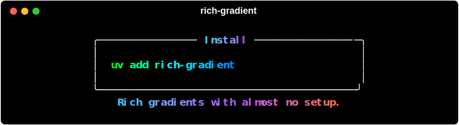

<a href="https://maxludden.github.io/rich-gradient/" alt="rich-gradient">
  
</a>

<p align="center">
  <a href="https://www.python.org/"></a>
  <a href="https://pypi.org/project/rich_gradient/"></a>
  <a href="https://pypi.org/project/rich_gradient/"></a>
  <a href="https://github.com/astral-sh/uv"></a>
</p>

## Purpose

`rich-gradient` layers smooth foreground and background gradients on top of [rich](https://github.com/Textualize/rich) renderables.
It includes a drop-in `Text` subclass, wrappers for `Panel` and `Rule`, utilities for building palettes, and
a Click/rich-click CLI for trying gradients from the terminal.

## Highlights

- Works anywhere Rich expects a `ConsoleRenderable`, including panels, tables, and live updates.
- Generates color stops automatically or from CSS color names, hex codes, RGB tuples, or `rich.color.Color` objects.
- Supports foreground and background gradients, rainbow palettes, and deterministic color spectrums.
- Ships with ready-to-use renderables:
    - [`Text`](text.md)
    - [`Gradient`](gradient.md)
    - [`Panel`](panel.md)
    - [`Rule`](rule.md)
    - [`Spectrum`](spectrum.md)
    - And their animated counterparts.

???+ note CLI

    Includes a CLI `rich-gradient` for quick experiments and SVG export for documentation or asset generation.

## Installation

<h3><a href="https://github.com/astral-sh/uv">uv</a> <em>(recommended)</em></h3>

```shell
uv add rich-gradient
```

or via `uv pip`

```shell
uv pip install rich-gradient
```

<br />

...or with pip:

<h3><a href="https://pip.pypa.io/en/stable/">pip</a></h3>

```shell
# via pip
pip install rich-gradient
```


## Quick start

```python
from rich.console import Console
from rich_gradient import Text

console = Console()
console.print(
    Text(
        "Rich gradients with almost no setup.",
        colors=["#38bdf8", "#a855f7", "#f97316"],
        style="bold",
        justify="center",
    )
)
```

The example above is bundled in `examples/text_quickstart.py` and renders:

<a href="#" class="copy-install" data-copy="uv add rich-gradient" title="Click to copy: <code>uv add rich-gradient</code>" aria-label="Copy install command">
    
</a>

## Explore the user guide

- [Text](text.md) – gradient-aware drop-in replacement for `rich.text.Text`.
- [Gradient](gradient.md) – wrap any renderable with foreground/background gradients.
- [Panel](panel.md) – gradient panels with highlighted titles and subtitles.
- [Rule](rule.md) – gradient horizontal rules with adjustable thickness.
- [Spectrum](spectrum.md) – generate and preview deterministic palettes.
- [CLI](cli.md) – scriptable demos and helpers built with Click + rich-click.
- [Animation](animation.md) – create animated gradients with `Live`.

## Latest (v0.3.9)

- CLI docs and examples reflect the Click + rich-click commands (`print`, `panel`, `rule`, `markdown`) with current options.
- Help text uses consistent rich markup styling across commands.
- Tests run without an editable install via the `tests/conftest.py` path shim.
- Docs background now respects the theme, removing the black/transparent flash on initial paint.

Prefer API-level details? See the [reference section](animated_gradient_ref.md) generated with `mkdocstrings`.
