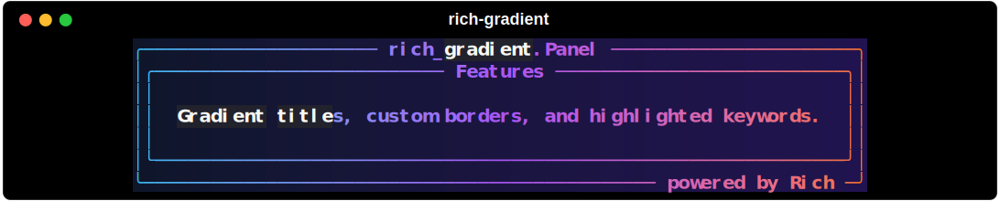

# Panel

`rich_gradient.Panel` wraps a `rich.panel.Panel`, applies gradient foreground and background colors, and automatically highlights the title and subtitle so they blend with the gradient. Because it inherits from [`Gradient`](gradient.md), every alignment and highlighting option is available.



```python
from rich.console import Console
from rich.panel import Panel as RichPanel
from rich_gradient import Panel

inner = RichPanel.fit(
    "[b]Gradient titles, custom borders, highlighted keywords.[/b]",
    title="[b]Features[/b]",
    border_style="white",
    padding=(1, 2),
)

console = Console()
console.print(
    Panel(
        inner,
        colors=["#38bdf8", "#a855f7", "#f97316"],
        bg_colors=["#0f172a", "#2c1067"],
        title="rich_gradient.Panel",
        subtitle="powered by Rich",
        border_style="bold #22d3ee",
        highlight_words=[(["Gradient", "keywords"], "bold white on black", False)],
    )
)
```

## Title and subtitle highlighting

When a title or subtitle is provided, the panel generates regex patterns that match the corresponding row in the rendered border and applies the supplied styles (`title_style` / `subtitle_style`). You can still pass your own `highlight_regex` or `highlight_words`; they’ll be merged with the title highlights.

## Other options

- `padding`, `box`, `safe_box`, `width`, `height`: forwarded to the underlying Rich panel.
- `colors`, `bg_colors`, `rainbow`, `hues`: the same controls exposed by [`Gradient`](gradient.md).
- `justify`, `vertical_justify`: control how the inner panel is positioned within the gradient.
- `expand`: whether the panel fills the available width.

For animation support, see [`AnimatedPanel`](animation.md).
