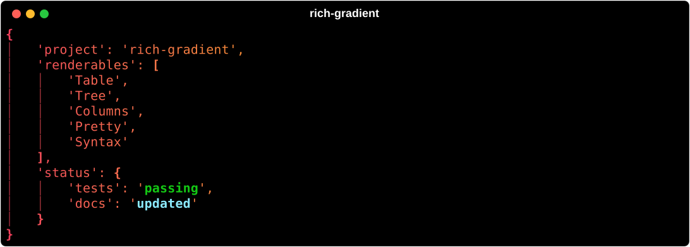

# Pretty

`rich_gradient.Pretty` wraps [`rich.pretty.Pretty`](https://rich.readthedocs.io/en/stable/pretty.html) so structured Python objects (dicts, lists, dataclasses, and so on) are printed with a gradient across the formatted output.



## Basic usage

```python
from rich.console import Console
from rich_gradient import Pretty

console = Console()
payload = {"project": "rich-gradient", "status": {"tests": "passing"}}
console.print(
    Pretty(
        payload,
        colors=["#f43f5e", "#f59e0b", "#22c55e"],
        indent_guides=True,
        expand_all=True,
    )
)
```

## Pretty options

The arguments Rich's `Pretty` takes are forwarded:

- `indent_size` and `indent_guides`: indentation width and guide lines.
- `expand_all`: expand every container onto multiple lines.
- `max_length`, `max_string`, `max_depth`: abbreviate long containers, long strings, and deep nesting.
- `highlighter`: a custom Rich highlighter.
- `pretty_justify`, `overflow`, `no_wrap`, `margin`, `insert_line`.

```python
from rich_gradient import Pretty

Pretty(
    {"items": list(range(100)), "name": "x" * 200},
    max_length=5,
    max_string=20,
    rainbow=True,
)
```

The underlying Rich object is available as `pretty.pretty`.

## Highlighting values

```python
from rich_gradient import Pretty

Pretty(
    {"tests": "passing", "docs": "updated"},
    colors=["#f43f5e", "#f59e0b", "#22c55e"],
    highlight_words={"passing": "bold green", "updated": "bold cyan"},
)
```

## Shared gradient options

Like every `Gradient`-based wrapper, `Pretty` accepts:

- `colors` / `bg_colors`: foreground and background color stops (CSS names, hex, RGB tuples, or `rich.color.Color`).
- `rainbow` and `hues`: generate a palette automatically (`hues` is at least 2).
- `repeat_scale`: leave it unset and one pass across the output runs from the first color to the last. See [`Gradient`](gradient.md).
- `justify` / `vertical_justify` / `expand`: position the output inside the gradient frame.
- `highlight_words` / `highlight_regex`: extra styles applied after the gradient pass.
- `console`: a specific Rich `Console` to render with.

For the full signature see the [Pretty reference](pretty_ref.md).
