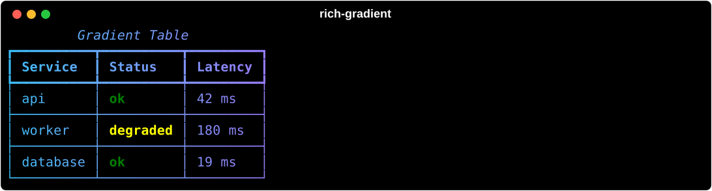
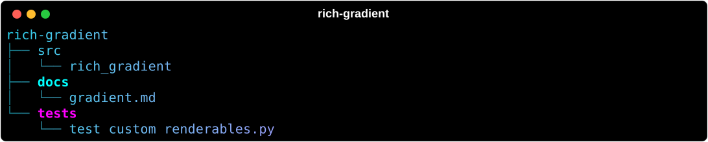
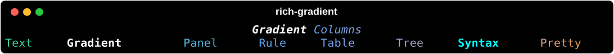
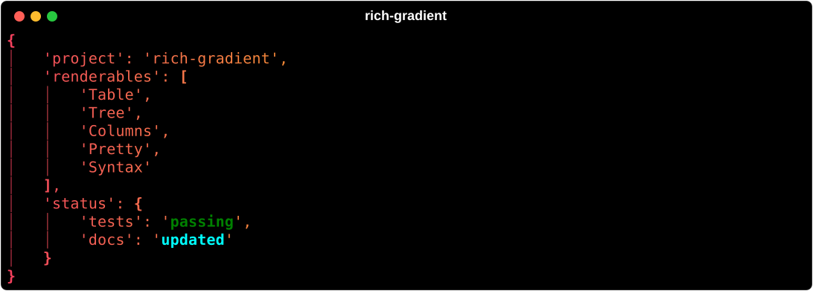
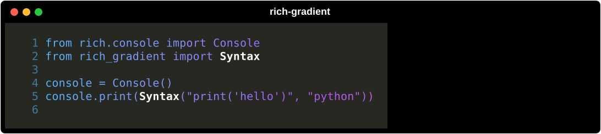

# Convenience Renderables

`rich-gradient` includes convenience wrappers for several Rich renderables. They
construct the underlying Rich object and then render it through
[`Gradient`](gradient.md), so you can use familiar Rich APIs while adding
foreground gradients, background gradients, rainbow palettes, alignment, and
highlight rules.

## Table

`Table` wraps `rich.table.Table` and forwards `add_column()` and `add_row()`.

```python
from rich.console import Console
from rich_gradient import Table

console = Console()
table = Table(
    "Service",
    "Status",
    "Latency",
    title="Gradient Table",
    colors=["#38bdf8", "#a855f7", "#f97316"],
    show_lines=True,
)
table.add_row("api", "ok", "42 ms")
table.add_row("worker", "degraded", "180 ms")
console.print(table)
```



## Tree

`Tree` wraps `rich.tree.Tree` and forwards `add()` for nested branches.

```python
from rich_gradient import Tree

tree = Tree("rich-gradient", colors=["#22d3ee", "#a78bfa", "#f472b6"])
src = tree.add("src")
src.add("rich_gradient")
tree.add("docs").add("gradient.md")
```



## Columns

`Columns` wraps `rich.columns.Columns` for multi-column lists of renderables.

```python
from rich_gradient import Columns

columns = Columns(
    ["Text", "Gradient", "Panel", "Rule", "Table", "Tree", "Syntax", "Pretty"],
    title="Gradient Columns",
    colors=["#34d399", "#60a5fa", "#f59e0b"],
    equal=True,
)
```



## Pretty

`Pretty` wraps `rich.pretty.Pretty` for structured Python objects.

```python
from rich_gradient import Pretty

Pretty(
    {"project": "rich-gradient", "status": {"tests": "passing"}},
    colors=["#f43f5e", "#f59e0b", "#22c55e"],
    indent_guides=True,
    expand_all=True,
)
```



## Syntax

`Syntax` wraps `rich.syntax.Syntax` for syntax-highlighted code.

```python
from rich_gradient import Syntax

Syntax(
    "print('hello')",
    "python",
    colors=["#38bdf8", "#a855f7", "#f97316"],
    line_numbers=True,
)
```



## Demos

Each wrapper module includes a direct demo:

```shell
uv run python src/rich_gradient/table.py
uv run python src/rich_gradient/tree.py
uv run python src/rich_gradient/columns.py
uv run python src/rich_gradient/pretty.py
uv run python src/rich_gradient/syntax.py
```
