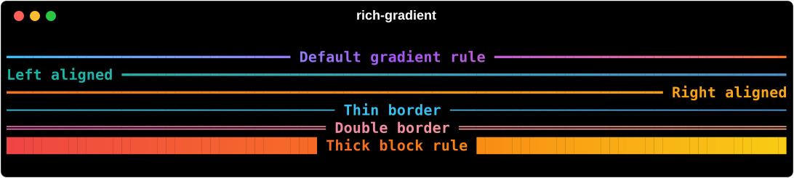

# Rule

`rich_gradient.Rule` wraps a `rich.rule.Rule` (via the `Gradient` base class) and applies gradient color stops (foreground and optional background) across the rule glyphs. Alignment and title options mirror the Rich rule.



```python
from rich.console import Console
from rich_gradient import Rule

console = Console()
console.print(Rule("Default gradient rule", colors=["#38bdf8", "#a855f7", "#f97316"]))
console.print(Rule("Left aligned", align="left", colors=["#14b8a6", "#6366f1"]))
console.print(Rule("Right aligned", align="right", colors=["#f97316", "#facc15"]))
console.print(Rule("Thin border", thickness=0, colors=["#22d3ee", "#6366f1"]))
console.print(Rule("Double border", thickness=2, colors=["#f472b6", "#facc15"]))
console.print(Rule("Thick block rule", thickness=3, colors=["#ef4444", "#f97316", "#facc15"]))
```

## Thickness and alignment

- `align`: `"left"`, `"center"` (default), or `"right"`.
- `thickness`: integer 0-3 controlling the glyph (`─`, `━`, `═`, `█` respectively).
- `characters`: provide your own glyph when you need full control.

The gradient is distributed across the rendered width after padding and indentation are applied.
`Rule` uses the same cell-aware rendering path as `Gradient`, so highlighted titles,
wide glyphs, combining characters, foreground gradients, and background gradients are
handled consistently.

## Titles and colors

Rules support `title` and `title_style`, and the rule's placement is controlled by `align`. Styles can reference any color supported by `rich.color.Color`, including CSS names and hex codes provided by `rich-color-ext`. Pass `bg_colors` to paint the rule background.

The example script that generates the gallery is saved as `examples/rule_gallery.py`.
