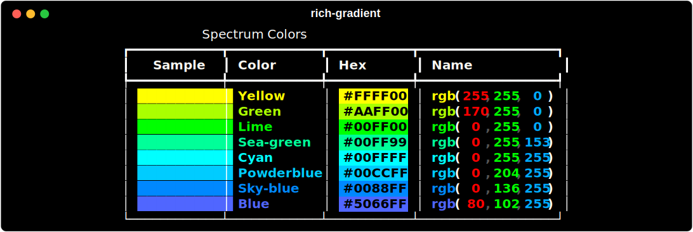

# Spectrum

`rich_gradient.spectrum.Spectrum` builds reusable color palettes for the rest of the package. It produces Rich `Color`, `Style`, and `ColorTriplet` objects and renders itself as a handy preview table.



```python
from rich.console import Console
from rich_gradient.spectrum import Spectrum

console = Console()
spectrum = Spectrum(hues=8, seed=42)
console.print(spectrum, justify="center")

# Use the palette elsewhere
palette = spectrum.triplets  # feed into Text/Gradient colors
hex_codes = spectrum.hex
```

Key options:

- `hues`: number of colors to produce (minimum 2).
- `invert`: reverse the resulting palette.
- `seed`: control reproducibility without disturbing the global random state.

Internally `rich-gradient` relies on `Spectrum` whenever it needs to auto-generate color stops (for example, `Text(hues=5)` or `Gradient(rainbow=True)`).
