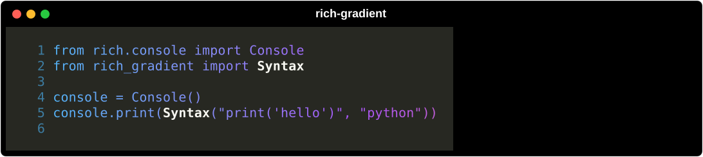

# Syntax

`rich_gradient.Syntax` wraps [`rich.syntax.Syntax`](https://rich.readthedocs.io/en/stable/syntax.html) for syntax-highlighted code with a gradient across the rendered block.



## Basic usage

```python
from rich.console import Console
from rich_gradient import Syntax

console = Console()
console.print(
    Syntax(
        "print('hello')",
        "python",
        colors=["#38bdf8", "#a855f7", "#f97316"],
        line_numbers=True,
    )
)
```

## Syntax options

The arguments Rich's `Syntax` takes are forwarded:

- `code` and `lexer`: the source and a lexer name (or Pygments lexer).
- `theme`: a Pygments theme, `"monokai"` by default.
- `line_numbers`, `start_line`, `line_range`, `highlight_lines`: line numbering and which lines to show or emphasise.
- `word_wrap`, `code_width`, `tab_size`, `dedent`: layout and whitespace.
- `indent_guides`, `padding`, `background_color`.

```python
from rich_gradient import Syntax

code = """\
def greet(name):
    return f"Hello, {name}!"
"""

Syntax(
    code,
    "python",
    theme="monokai",
    line_numbers=True,
    highlight_lines={2},
    padding=(1, 2),
    rainbow=True,
)
```

The underlying Rich object is available as `syntax.syntax`.

## Highlighting words

```python
from rich_gradient import Syntax

Syntax(
    "from rich_gradient import Syntax",
    "python",
    colors=["#38bdf8", "#a855f7", "#f97316"],
    highlight_words={"Syntax": "bold white"},
)
```

## Shared gradient options

Like every `Gradient`-based wrapper, `Syntax` accepts:

- `colors` / `bg_colors`: foreground and background color stops (CSS names, hex, RGB tuples, or `rich.color.Color`).
- `rainbow` and `hues`: generate a palette automatically (`hues` is at least 2).
- `repeat_scale`: leave it unset and one pass across the output runs from the first color to the last. See [`Gradient`](gradient.md).
- `justify` / `vertical_justify` / `expand`: position the code block inside the gradient frame.
- `highlight_words` / `highlight_regex`: extra styles applied after the gradient pass.
- `console`: a specific Rich `Console` to render with.

For the full signature see the [Syntax reference](syntax_ref.md).
