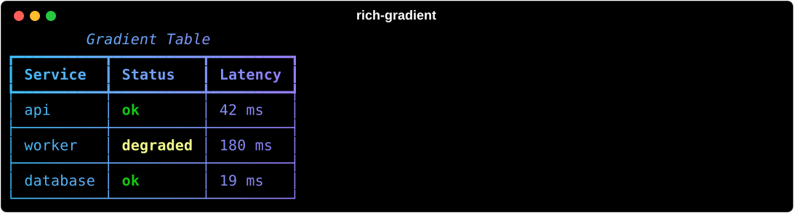

# Table

`rich_gradient.Table` wraps [`rich.table.Table`](https://rich.readthedocs.io/en/stable/tables.html), then renders it through [`Gradient`](gradient.md). You build it exactly like a Rich table (`add_column()` and `add_row()` are forwarded) and get a foreground and background gradient across the whole table, borders included.



## Basic usage

```python
from rich.console import Console
from rich_gradient import Table

console = Console()
table = Table(
    "Service",
    "Status",
    "Latency",
    title="Gradient Table",
    colors=["#38bdf8", "#a855f7", "#f97316"],
    show_lines=True,
)
table.add_row("api", "ok", "42 ms")
table.add_row("worker", "degraded", "180 ms")
console.print(table)
```

## Columns and rows

Pass headers positionally (strings or `rich.table.Column` instances), or add columns afterwards with `add_column()`, which forwards its arguments to Rich:

```python
from rich_gradient import Table

table = Table(title="Releases", rainbow=True)
table.add_column("Version", style="bold")
table.add_column("Notes", justify="right")
table.add_row("0.4.0", "Gradients reach their end colors")
table.add_row("0.3.15", "Documentation refresh")
```

The underlying Rich table is available as `table.table` when you need an API the wrapper does not forward.

## Table options

Everything `rich.table.Table` accepts is forwarded: `title`, `caption`, `box`, `show_header`, `show_footer`, `show_edge`, `show_lines`, `leading`, `padding`, `pad_edge`, `collapse_padding`, `width`, `min_width`, `expand`, `style`, `row_styles`, `header_style`, `footer_style`, `border_style`, `title_style`, `caption_style`, `title_justify`, `caption_justify`, `safe_box`, and `highlight`.

## Highlighting cell values

Highlights are applied after the gradient, so you can call out statuses without losing the gradient elsewhere:

```python
from rich_gradient import Table

table = Table(
    "Service",
    "Status",
    colors=["#38bdf8", "#a855f7", "#f97316"],
    highlight_words={"ok": "bold green", "degraded": "bold yellow"},
)
table.add_row("api", "ok")
table.add_row("worker", "degraded")
```

## Shared gradient options

Like every `Gradient`-based wrapper, `Table` accepts:

- `colors` / `bg_colors`: foreground and background color stops (CSS names, hex, RGB tuples, or `rich.color.Color`).
- `rainbow` and `hues`: generate a palette automatically (`hues` is at least 2).
- `repeat_scale`: leave it unset and one pass across the output runs from the first color to the last. See [`Gradient`](gradient.md).
- `justify` / `vertical_justify` / `expand`: position the table inside the gradient frame.
- `highlight_words` / `highlight_regex`: extra styles applied after the gradient pass.
- `console`: a specific Rich `Console` to render with.

For the full signature see the [Table reference](table_ref.md). The example script lives in `examples/renderables_showcase.py`.
