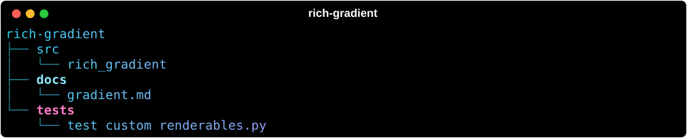

# Tree

`rich_gradient.Tree` wraps [`rich.tree.Tree`](https://rich.readthedocs.io/en/stable/tree.html) and paints a gradient across the label, branches, and guide lines. `add()` is forwarded so you build nested branches the way you would with Rich.



## Basic usage

```python
from rich.console import Console
from rich_gradient import Tree

console = Console()
tree = Tree("rich-gradient", colors=["#22d3ee", "#a78bfa", "#f472b6"])
src = tree.add("src")
src.add("rich_gradient")
tree.add("docs").add("gradient.md")
console.print(tree)
```

## Building branches

`tree.add(label)` returns the new branch, a regular `rich.tree.Tree`, so you can keep adding to it. Labels can be strings, Rich markup, or any renderable. The branch `style`, `guide_style`, `expanded`, and `highlight` arguments are forwarded as well.

```python
from rich_gradient import Tree

tree = Tree("project", rainbow=True)
package = tree.add("[bold]src[/bold]")
package.add("gradient.py")
package.add("text.py")
tree.add("tests", expanded=False)
```

## Tree options

- `style`, `guide_style`: base style and the style of the guide lines.
- `expanded`: whether child nodes are shown.
- `highlight`: let Rich highlight labels.
- `hide_root`: hide the root label.

The underlying Rich tree is available as `tree.tree`.

## Highlighting labels

```python
from rich_gradient import Tree

tree = Tree(
    "rich-gradient",
    colors=["#22d3ee", "#a78bfa", "#f472b6"],
    highlight_words={"docs": "bold cyan", "tests": "bold magenta"},
)
tree.add("docs")
tree.add("tests")
```

## Shared gradient options

Like every `Gradient`-based wrapper, `Tree` accepts:

- `colors` / `bg_colors`: foreground and background color stops (CSS names, hex, RGB tuples, or `rich.color.Color`).
- `rainbow` and `hues`: generate a palette automatically (`hues` is at least 2).
- `repeat_scale`: leave it unset and one pass across the output runs from the first color to the last. See [`Gradient`](gradient.md).
- `justify` / `vertical_justify` / `expand`: position the tree inside the gradient frame.
- `highlight_words` / `highlight_regex`: extra styles applied after the gradient pass.
- `console`: a specific Rich `Console` to render with.

For the full signature see the [Tree reference](tree_ref.md).
